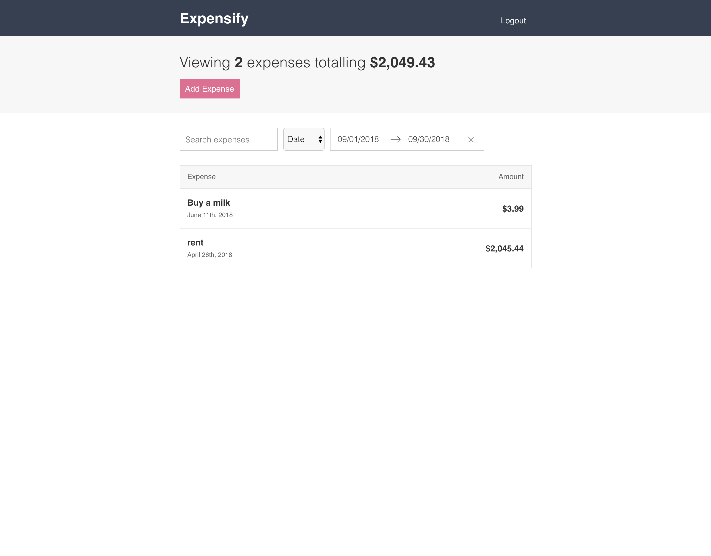

# expensify-app
Udemy React Tutorial 

Complete the React & Redux course on Udemy [Link](https://www.udemy.com/react-2nd-edition)

Building a complex app with React & Redux

  
  
  

See working demo [Link](https://react-redux-expensify-tutorial.herokuapp.com/)

  

## Features
- Add the expenses
- Remove the expense
- Edit the expense
- View the expenses on dashboard page
- Filter by date or amount
- etc..

## Tech Spec
- React
- Redux
- React-Router-Dom

